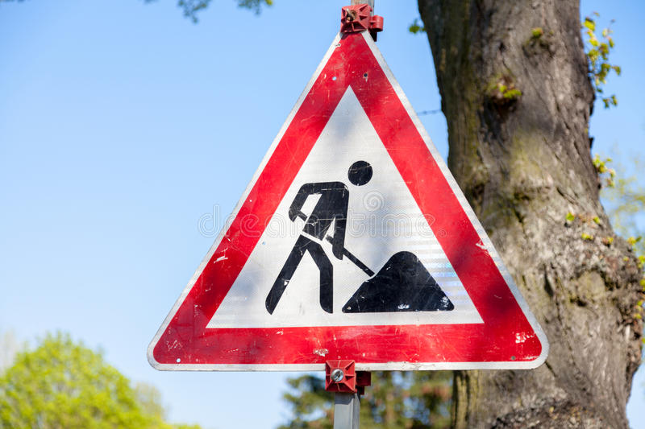

# **Traffic Sign Recognition** 

## Writeup

---

**Build a Traffic Sign Recognition Project**

The goals / steps of this project are the following:
* Load the data set
* Explore, summarize and visualize the data set
* Design, train and test a model architecture
* Use the model to make predictions on new images
* Analyze the softmax probabilities of the new images
* Summarize the results with a written report

---

### Data Set Summary & Exploration

#### 1. Provide a basic summary of the data set. In the code, the analysis should be done using python, numpy and/or pandas methods rather than hardcoding results manually.

I used the numpy library to calculate summary statistics of the traffic
signs data set:

* The size of training set is : 34799
* The size of the validation set is : 4410
* The size of test set is : 12630
* The shape of a traffic sign image is : (32, 32, 3)
* The number of unique classes/labels in the data set is : 43

#### 2. Include an exploratory visualization of the dataset.

1. Distribution of classes in the training dataset

2. Distribution of classes in the validation dataset

3. Distribution of classes in the testing dataset

Observation:

1. One can easily notice that the training, validation and test set, all come from the same distribution. 
2. Some classes have less samples and some have more.
3. Since there are multiple classes for speed limit alone, there might a possibility that the network might overfit to the 'speed limit' kind of traffic sign images.

### Design and Test a Model Architecture

#### 1. Describe how you preprocessed the image data. What techniques were chosen and why did you choose these techniques? Consider including images showing the output of each preprocessing technique. Pre-processing refers to techniques such as converting to grayscale, normalization, etc. 

1. Initially, I used the colored the images to train the network (LeNet architecture), but since the performance of the model was not considerably good (accuracy less than 80% on the validation set). I decided to pre-process the image and converted the images to grayscale.

2. Another important pre-processing step was to normalize the pixel values of the images.

#### 2. Describe what your final model architecture looks like including model type, layers, layer sizes, connectivity, etc.) Consider including a diagram and/or table describing the final model.

My final model consisted of the following layers:

| Layer         		|     Description	        					| 
|:---------------------:|:---------------------------------------------:| 
| Input         		| 32x32x1 Gray Scale image   							| 
| Convolution 5x5x6     	| 1x1 stride, valid padding, outputs 28x28x6 	|
| RELU					|												|
| Max pooling	      	| 2x2 stride,  outputs 14x14x16 				|
| Convolution 5x5x16	    | 1x1 stride,  valid padding, outputs 10x10x16      									|
| RELU					|												|
| Max pooling	      	| 2x2 stride,  outputs 5x5x16 				|
| Flatten         |  outputs 400
| Fully connected (Dense)		| outputs 120        									|
| RELU				|        									|
| Fully connected (Dense)		| outputs 84        									|
| RELU				|        									|
| Fully connected (Dense)		| outputs 43        									|

#### 3. Describe how you trained your model. The discussion can include the type of optimizer, the batch size, number of epochs and any hyperparameters such as learning rate.

To train the model I tried various combination of parameters and regularization. The final model had following parameters and optimzation techniques:

Final model:

| Paramter / Function | Description |
|:---------------------:|:---------------------------------------------:| 
| EPOCHS | 20 |
| BATCH_SIZE | 256 |
| Learning Rate | 0.01 |
| Loss function | softmax_cross_entropy_with_logits_v2 |
| Optimizer | Adam |

#### 4. Describe the approach taken for finding a solution and getting the validation set accuracy to be at least 0.93. Include in the discussion the results on the training, validation and test sets and where in the code these were calculated. Your approach may have been an iterative process, in which case, outline the steps you took to get to the final solution and why you chose those steps. Perhaps your solution involved an already well known implementation or architecture. In this case, discuss why you think the architecture is suitable for the current problem.

Observation:

Architecture:

1. I began with LeNet architecture and played aroung with the model by removing and adding layers and modifying the filter sizes etc. However, the final model is pretty much the similar to the LeNet architecture.
2. I chose LeNet because it was already fine tuned for the multiclass classification task on images and proven to work.
3. The initial results on the given dataset quickly indicated that the model was working without much changes to the network architecture.
4. Tried Dropout regularization after each Dense (Fully Connected) layer in the netwrok, however did not observe any signification improvement in the model performance (on the validation dataset). Hence, got rid of the dropout regularization in the final model.

Other paramters:

1. Learning rate had a significant affect of the model accuracy and was chosen using trial and error method.
2. After few epochs the accuracy would not increase any further, hence I maxed the epoch to 20.
3. Adam optimizer resulted in the highest accuracy when compared to other optimization algorithms.

My final model results were:
* training set accuracy of : 99.6 %
* validation set accuracy of : 94.7 %
* test set accuracy of : 92.3 %

### Test a Model on New Images

#### 1. Choose five German traffic signs found on the web and provide them in the report. For each image, discuss what quality or qualities might be difficult to classify.

Here are five German traffic signs that I found on the web:

The first 3 images might be easy to classify, because there are similar images present in the training dataset. The last 2 images 'turn right ahead' and 'speed limit 120' have unique backgrounds and hence may be misclassified. The 4th image 'pedestrian' sign might also be misclassified, since the training set does not have many samples of this class and hence might not have learnt into the model.

#### 2. Discuss the model's predictions on these new traffic signs and compare the results to predicting on the test set. At a minimum, discuss what the predictions were, the accuracy on these new predictions, and compare the accuracy to the accuracy on the test set (OPTIONAL: Discuss the results in more detail as described in the "Stand Out Suggestions" part of the rubric).

Here are the results of the prediction:

| Image			        |     Prediction	        					| 
|:---------------------:|:---------------------------------------------:| 
| Stop Sign      		| Stop sign   									| 
| No Entry    			| No Entry 										|
| Road Work				| Road Work											|
| Pedestrians      		| Road Work					 				|
| Turn right ahead		| Go straight or left      							|
| Speed limit (120 km/h)		| Turn left shead     							|

The model was able to correctly guess 4 of the 5 traffic signs, which gives an accuracy of 80%. This compares favorably to the accuracy on the test set of ...

#### 3. Describe how certain the model is when predicting on each of the five new images by looking at the softmax probabilities for each prediction. Provide the top 5 softmax probabilities for each image along with the sign type of each probability. (OPTIONAL: as described in the "Stand Out Suggestions" part of the rubric, visualizations can also be provided such as bar charts)

The code for making predictions on my final model is located in the 11th cell of the Ipython notebook.

For the first image, the model is relatively sure that this is a stop sign (probability of 0.6), and the image does contain a stop sign. The top five soft max probabilities were

| Probability         	|     Prediction	        					| 
|:---------------------:|:---------------------------------------------:| 
| .60         			| Stop sign   									| 
| .20     				| U-turn 										|
| .05					| Yield											|
| .04	      			| Bumpy Road					 				|
| .01				    | Slippery Road      							|

For the second image ... 

### (Optional) Visualizing the Neural Network (See Step 4 of the Ipython notebook for more details)
#### 1. Discuss the visual output of your trained network's feature maps. What characteristics did the neural network use to make classifications?

